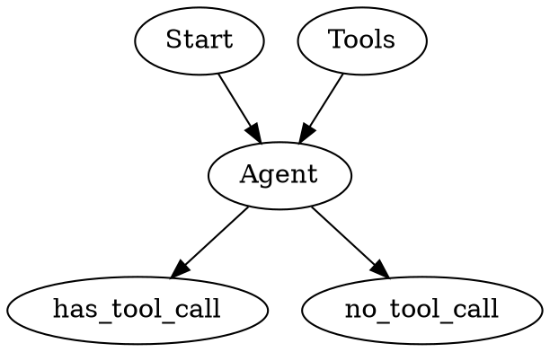

# LangGraph Execution Flow

## Overview

Control how an agent moves through its graph - from initial call through reasoning, tool execution, and final response.

## When to Use

- Setting up agent decision logic
- Handling interruptions and pauses
- Creating multi-stage agent pipelines
- Managing agent loops (preventing infinite loops)

## Execution Flow Pattern



## Conditional Edge Functions

```python
from langchain_core.messages import ToolMessage

def should_continue(state: AgentState) -> str:
    """Determine next step based on last message."""
    messages = state["messages"]
    last_message = messages[-1]
    
    if hasattr(last_message, "tool_calls") and last_message.tool_calls:
        return "tools"
    return "end"

def should_interrupt(state: AgentState) -> str:
    """Check if agent should pause for human input."""
    if state.get("requires_approval", False):
        return "await_input"
    return "continue"
```

## Edge Patterns

### Conditional Edge (router)

```python
workflow.add_conditional_edges(
    "agent",
    should_continue,
    {
        "tools": "tools_node",
        "end": END
    }
)
```

### Multiple Conditions

```python
def route_decision(state: AgentState) -> str:
    """Route based on message type and state."""
    last_message = state["messages"][-1]
    
    if state.get("error_count", 0) > 3:
        return "escalate"
    
    if hasattr(last_message, "tool_calls"):
        return "tools"
    
    if state.get("awaiting_human", False):
        return "await_input"
    
    return "respond"
```

### Interrupt Pattern (for human-in-loop)

```python
from langgraph.types import Interrupt

def check_for_interrupt(state: AgentState) -> str:
    """Pause agent for human approval when needed."""
    if state.get("needs_approval", False):
        raise Interrupt(value={
            "reason": "human_review_required",
            "state": state
        })
    return "continue"
```

## Loop Prevention

```python
MAX_ITERATIONS = 10

class AgentState(TypedDict):
    iteration_count: int
    # ... other fields

def increment_iteration(state: AgentState) -> AgentState:
    """Track iterations to prevent infinite loops."""
    count = state.get("iteration_count", 0) + 1
    if count >= MAX_ITERATIONS:
        raise ValueError("Max iterations exceeded")
    return {"iteration_count": count}
```

## Resume After Interrupt

```python
from langgraph.types import Command

def resume_agent(agent, thread_id: str, user_input: dict):
    """Resume agent after human interrupt."""
    return agent.invoke(
        Command(resume=user_input),
        config={"configurable": {"thread_id": thread_id}}
    )
```

## Streaming Execution

```python
async def stream_agent(agent, input_data: dict):
    """Stream agent execution steps to UI."""
    async for event in agent.astream_events(input_data):
        if event["event"] == "on_chain_stream":
            yield event["data"]
```

## Quick Reference

| Function | Purpose |
|---------|---------|
| `should_continue` | Router after agent node |
| `add_conditional_edges` | Dynamic routing |
| `Interrupt` | Pause for human input |
| `Command(resume=...)` | Resume after interrupt |
| `astream_events` | Stream execution steps |

## Common Patterns

| Pattern | Use Case |
|---------|----------|
| Agent → Tools → Agent | Tool-using agent |
| Agent → Interrupt → Agent | Human-in-loop |
| Agent → Router → Various | Multi-capability agent |
| Agent → Loop (max N) | Bounded execution |

## Common Mistakes

| Mistake | Fix |
|---------|-----|
| Infinite loops | Add iteration counter |
| Missing END | Always add terminal edge |
| No interrupt handling | Use Command(resume=...) |
| Blocking stream | Use astream_events() |

## Next Steps

- `fastapi-agent-endpoints` - Expose via WebSocket
- `react-streaming-display` - Show execution to user
- `interactive-agent-controls` - Pause/resume from UI
