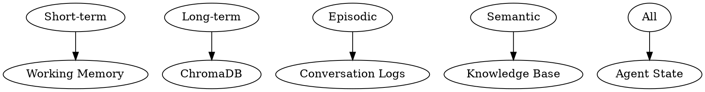

# Agent Memory Patterns

## Overview

Design effective memory systems for AI agents using short-term (working), long-term (persistent), and episodic memory patterns.

## When to Use

- Building agents with persistent memory
- Managing conversation history across sessions
- Implementing multi-tier memory architectures
- Handling session vs persistent context

## Memory Architecture



## Memory Tiers

| Tier | Duration | Storage | Use Case |
|------|----------|---------|----------|
| Working | Current session | State | Active reasoning |
| Short-term | Days | SQLite | Recent context |
| Long-term | Indefinite | ChromaDB | Semantic memory |
| Episodic | Indefinite | SQLite | Past events |

## Working Memory (State)

```python
class AgentState(TypedDict):
    messages: list  # Recent conversation
    current_task: str
    relevant_facts: list[str]
    pending_tools: list[str]
    session_start: str
```

## Short-Term Memory (SQLite)

```python
import sqlite3
from datetime import datetime, timedelta

class ShortTermMemory:
    def __init__(self, db_path: str = "memory.db"):
        self.conn = sqlite3.connect(db_path)
        self._create_table()
    
    def _create_table(self):
        self.conn.execute("""
            CREATE TABLE IF NOT EXISTS short_term_memory (
                id INTEGER PRIMARY KEY AUTOINCREMENT,
                thread_id TEXT,
                key TEXT,
                value TEXT,
                created_at TIMESTAMP DEFAULT CURRENT_TIMESTAMP
            )
        """)
        self.conn.commit()
    
    def store(self, thread_id: str, key: str, value: str):
        self.conn.execute(
            "INSERT INTO short_term_memory (thread_id, key, value) VALUES (?, ?, ?)",
            (thread_id, key, value)
        )
        self.conn.commit()
    
    def retrieve(self, thread_id: str, hours: int = 24) -> list[dict]:
        cursor = self.conn.execute("""
            SELECT key, value, created_at 
            FROM short_term_memory 
            WHERE thread_id = ? AND created_at > datetime('now', '-' || ? || ' hours')
            ORDER BY created_at DESC
        """, (thread_id, hours))
        return [{"key": r[0], "value": r[1], "time": r[2]} for r in cursor]
    
    def cleanup(self, days: int = 7):
        self.conn.execute("""
            DELETE FROM short_term_memory 
            WHERE created_at < datetime('now', '-' || ? || ' days')
        """, (days,))
        self.conn.commit()
```

## Long-Term Memory (ChromaDB)

```python
class LongTermMemory:
    def __init__(self, vectorstore: Chroma):
        self.vectorstore = vectorstore
    
    def store_fact(self, fact: str, category: str, importance: int = 1):
        doc_id = f"fact_{category}_{datetime.now().timestamp()}"
        self.vectorstore.add_texts(
            texts=[fact],
            ids=[doc_id],
            metadatas=[{"category": category, "importance": importance}]
        )
    
    def retrieve_facts(self, query: str, category: str = None, k: int = 5) -> list:
        results = self.vectorstore.similarity_search(query, k=k)
        
        if category:
            results = [r for r in results if r.metadata.get("category") == category]
        
        return results
    
    def forget(self, doc_id: str):
        self.vectorstore.delete(ids=[doc_id])
```

## Episodic Memory (Conversation Logs)

```python
class EpisodicMemory:
    def __init__(self, db_path: str = "episodes.db"):
        self.conn = sqlite3.connect(db_path)
        self._create_table()
    
    def _create_table(self):
        self.conn.execute("""
            CREATE TABLE IF NOT EXISTS episodes (
                id INTEGER PRIMARY KEY AUTOINCREMENT,
                thread_id TEXT,
                summary TEXT,
                outcome str,
                timestamp TIMESTAMP DEFAULT CURRENT_TIMESTAMP
            )
        """)
        self.conn.commit()
    
    def store_episode(self, thread_id: str, summary: str, outcome: str):
        self.conn.execute(
            "INSERT INTO episodes (thread_id, summary, outcome) VALUES (?, ?, ?)",
            (thread_id, summary, outcome)
        )
        self.conn.commit()
    
    def get_recent_episodes(self, limit: int = 10) -> list[dict]:
        cursor = self.conn.execute("""
            SELECT thread_id, summary, outcome, timestamp 
            FROM episodes 
            ORDER BY timestamp DESC LIMIT ?
        """, (limit,))
        return [{"thread": r[0], "summary": r[1], "outcome": r[2], "time": r[3]} for r in cursor]
```

## Memory Consolidation

```python
def consolidate_memory(short_term: ShortTermMemory, long_term: LongTermMemory, thread_id: str):
    """Move important short-term memories to long-term storage."""
    recent = short_term.retrieve(thread_id, hours=48)
    
    for memory in recent:
        if is_important(memory["value"]):
            long_term.store_fact(
                fact=memory["value"],
                category="consolidated",
                importance=2
            )
    
    short_term.cleanup(days=3)
```

## Memory-Enabled Agent Node

```python
def memory_aware_agent(state: AgentState) -> AgentState:
    """Agent that uses multiple memory tiers."""
    thread_id = state.get("thread_id", "default")
    
    recent = short_term.retrieve(thread_id, hours=24)
    relevant = long_term.retrieve_facts(state["messages"][-1].content)
    
    context = f"Recent memory:\n{format_recent(recent)}\n\nFacts:\n{format_facts(relevant)}"
    
    response = llm.invoke(f"{context}\n\nUser: {state['messages'][-1].content}")
    
    return {
        "messages": state["messages"] + [response],
        "recent_context": recent,
        "retrieved_facts": relevant
    }
```

## Quick Reference

| Pattern | Storage | Duration |
|---------|---------|----------|
| Working | State dict | Session |
| Short-term | SQLite | Days |
| Long-term | ChromaDB | Permanent |
| Episodic | SQLite | Permanent |

## Common Patterns

| Pattern | Description |
|---------|-------------|
| Memory hierarchy | Fast (working) → Slow (persistent) |
| Consolidation | Periodically move memory tiers |
| Importance scoring | Prioritize memory retention |
| Forgetting | Delete low-value memories |

## Common Mistakes

| Mistake | Fix |
|---------|-----|
| Unlimited history | Set message limit in state |
| No cleanup | Schedule memory cleanup |
| Memory isolation | Link memories to thread_id |
| Missing importance | Score and filter memories |

## Next Steps

- `chromadb-integration` - Set up vector storage
- `rag-context-management` - Use memory in RAG
- `langgraph-execution-flow` - Integrate memory into flow
