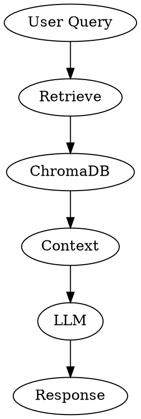

# RAG Context Management

## Overview

Implement retrieval-augmented generation by fetching relevant documents from ChromaDB and injecting them into agent prompts for context-aware responses.

## When to Use

- Building knowledge-augmented agents
- Adding domain-specific context to responses
- Enabling agents to reference past information
- Reducing hallucinations with grounded facts

## RAG Flow



## Context Retrieval Node

```python
def retrieve_node(state: AgentState) -> AgentState:
    """Retrieve relevant documents from vector store."""
    query = state["messages"][-1].content
    
    docs = vectorstore.similarity_search(query, k=3)
    
    context = "\n\n".join([
        f"Source: {doc.metadata.get('source', 'unknown')}\n{doc.page_content}"
        for doc in docs
    ])
    
    return {"context": {"docs": docs, "text": context}}
```

## Context Injection into Prompt

```python
def agent_with_context(state: AgentState, config: dict) -> AgentState:
    """Agent that uses retrieved context."""
    context = state.get("context", {}).get("text", "No relevant context found.")
    
    prompt = f"""You are a helpful retail assistant.
    
Relevant Context:
{context}

Previous Conversation:
{format_messages(state["messages"])}

User: {state["messages"][-1].content}

Provide a response based on the context above."""

    response = llm.invoke(prompt)
    
    return {"messages": state["messages"] + [response]}
```

## Conditional RAG (only when needed)

```python
def should_retrieve(state: AgentState) -> str:
    """Only retrieve if query needs external knowledge."""
    query = state["messages"][-1].content.lower()
    
    retrieval_keywords = ["what", "who", "when", "where", "find", "search", "remember"]
    
    if any(kw in query for kw in retrieval_keywords):
        return "retrieve"
    return "respond_direct"

workflow.add_conditional_edges(
    "agent",
    should_retrieve,
    {"retrieve": "retrieve_node", "respond_direct": "respond_node"}
)
```

## Context Window Management

```python
MAX_CONTEXT_TOKENS = 4000

def truncate_context(context_text: str) -> str:
    """Truncate context to fit token limit."""
    words = context_text.split()
    truncated = []
    token_count = 0
    
    for word in words:
        token_count += len(word) // 4 + 1
        if token_count > MAX_CONTEXT_TOKENS:
            break
        truncated.append(word)
    
    return " ".join(truncated)
```

## Hybrid Retrieval (Vector + Keyword)

```python
from langchain.retrievers import EnsembleRetriever

keyword_retriever = vectorstore.as_retriever(
    search_type="mmr",
    search_kwargs={"k": 3, "fetch_k": 10}
)

ensemble_retriever = EnsembleRetriever(
    retrievers=[vector_retriever, keyword_retriever],
    weights=[0.5, 0.5]
)
```

## Re-ranking Retrieved Results

```python
from langchain.retrievers import ContextualCompressionRetriever
from langchain_cohere import CohereRerank

compressor = CohereRerank()
compression_retriever = ContextualCompressionRetriever(
    base_retriever=vector_retriever,
    compressors=[compressor]
)
```

## Storing Agent Outputs as Memory

```python
def store_in_memory(state: AgentState) -> AgentState:
    """Store agent response for future retrieval."""
    response = state["messages"][-1].content
    
    if len(state["messages"]) > 2:
        doc_id = f"conversation_{state.get('thread_id', 'unknown')}_{len(state['messages'])}"
        
        vectorstore.add_texts(
            texts=[response],
            ids=[doc_id],
            metadatas=[{
                "type": "agent_response",
                "thread_id": state.get("thread_id", "unknown")
            }]
        )
    
    return state
```

## Quick Reference

| Pattern | Use Case |
|---------|----------|
| Direct injection | Always provide context |
| Conditional retrieval | Only retrieve when needed |
| Truncation | Manage context length |
| Hybrid retrieval | Better diversity |
| Re-ranking | Improve relevance |

## Agent State with RAG

```python
class AgentState(TypedDict):
    messages: list
    context: dict  # RAG context
    retrieved_docs: list
    context_used: bool
```

## Common Mistakes

| Mistake | Fix |
|---------|-----|
| Too much context | Truncate to token limit |
| No retrieval trigger | Use conditional edges |
| Stale context | Refresh on new queries |
| Not storing outputs | Add memory storage |

## Dependencies

```bash
pip install langchain langchain-chroma
```

## Next Steps

- `agent-memory-patterns` - Design long-term memory
- `chromadb-integration` - Set up vector store
- `langgraph-agent-setup` - Integrate into agent
