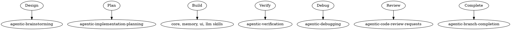

# Using Agentic MVP Skills

## Overview

**Agentic MVP Skills** provides reusable guidance for building AI agent systems using LangGraph + FastAPI + React + Ollama + ChromaDB.

## Skill Categories

| Category | Purpose |
|----------|---------|
| `core/` | LangGraph agent setup, tool binding, execution flow, FastAPI endpoints |
| `memory/` | ChromaDB integration, RAG context, memory patterns |
| `ui/` | React streaming display, agent state visualization, interactive controls |
| `llm/` | Ollama integration, prompt templates, model switching |
| `devops/` | Environment setup, Ollama installation, deployment |

## How to Access Skills

**In Claude Code:** Use the `Skill` tool to load a specific skill:
```
/agentic-mvp-skills:<skill-name>
```

## Workflow Integration

Use skills with superpowers companion skills:



## Skill Priority for Agentic Development

1. **Design first** - Use `agentic-brainstorming` before building any agent
2. **Plan second** - Use `agentic-implementation-planning` for multi-step features
3. **Implement** - Use core/memory/ui/llm skills for specific components
4. **Verify** - Use `agentic-verification` before claiming completion
5. **Debug if needed** - Use `agentic-debugging` for issues

## When to Use Each Category

| Situation | Skills to Load |
|-----------|---------------|
| Creating new agent | `langgraph-agent-setup`, `langgraph-tool-binding` |
| Adding memory | `chromadb-integration`, `rag-context-management` |
| Building UI | `react-streaming-display`, `agent-state-visualization` |
| Configuring LLM | `ollama-integration`, `prompt-template-system` |
| Setting up environment | `environment-setup`, `ollama-setup` |
| Multi-agent systems | `langgraph-execution-flow`, `multi-agent-development` |

## Quick Reference

| Task | Primary Skill |
|------|--------------|
| Initialize LangGraph agent | `langgraph-agent-setup` |
| Bind Python tools to agent | `langgraph-tool-binding` |
| Create WebSocket streaming | `fastapi-agent-endpoints` |
| Store embeddings in ChromaDB | `chromadb-integration` |
| Retrieve context for agent | `rag-context-management` |
| Stream agent thoughts to UI | `react-streaming-display` |
| Display agent execution steps | `agent-state-visualization` |
| Connect to local Ollama | `ollama-integration` |
| Switch between models | `model-switching` |
| Setup local environment | `environment-setup` |

## Key Principles

- **Design before building** - Always brainstorm agent systems first
- **Modular skills** - Each skill focuses on one component
- **Stack-specific** - Skills target LangGraph + FastAPI + React + Ollama + ChromaDB
- **Combine with superpowers** - Use agentic-* skills for process guidance
